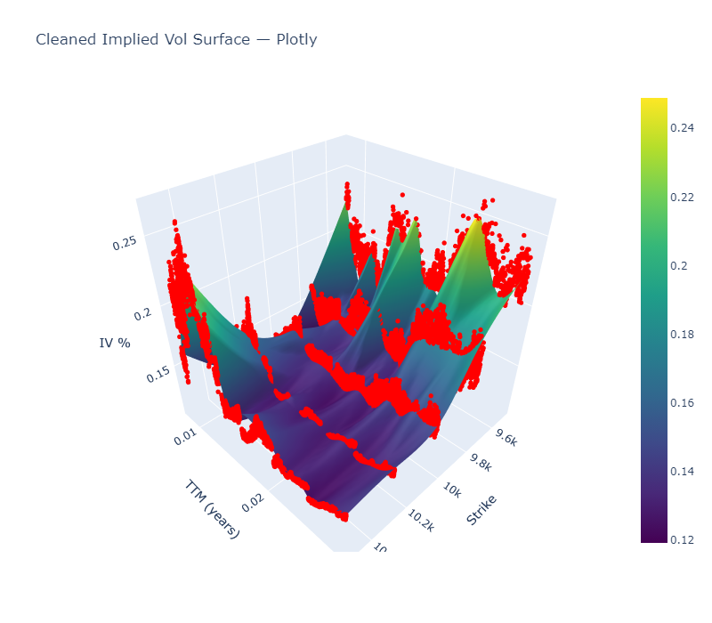

# Round 3 In-Depth Implementation

Dive into our full **Round 3** analysis and trading logic inside the [Jupyter Notebook](round3_strats&analysis.ipynb) provided in this folder.

## Important Dependencies

This notebook utilizes *Plotly.js* to produce beautiful images like so:

For the time being, please utilize tools like ChatGPT to resolve dependencies. They will be command line pip installs that will resolve the issue.

## How to run the notebook

1. Clone (or download) the repository.  
2. **Important:** ensure the `data/` directory sits **alongside** the notebook  
   (i.e. `round3_strats&analysis.ipynb` and `data/` should live in the same folder).  
3. Launch Jupyter (or VS Code / JupyterLab), open the notebook, and run the cells top-to-bottom.

Have fun experimenting—and let us know if you spot improvements!
